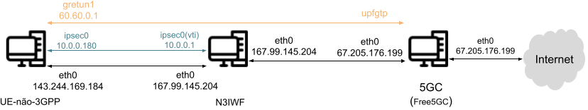

# Experiment 1
In this experiment, we will address the deployment process of the UE-non-3GPP, N3IWF, and Free5GC components in a cloud environment, utilizing three virtual machines provisioned in a cloud environment. Figure 1 illustrates the topology used in this experiment. In the figure, we can see that three VMs are depicted: the first for the provisioning of the UE-non-3GPP, the second for the provisioning of the N3IWF, and the third dedicated to running the remaining network functions that comprise the 5G core.

     

